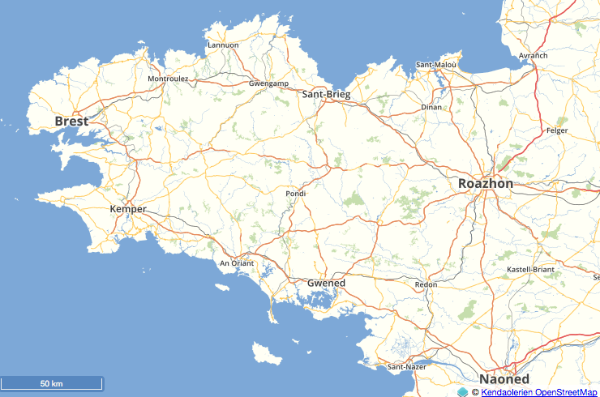
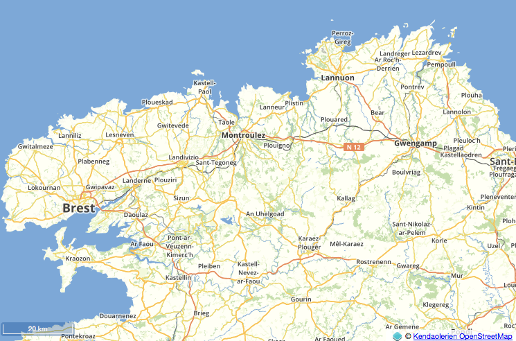
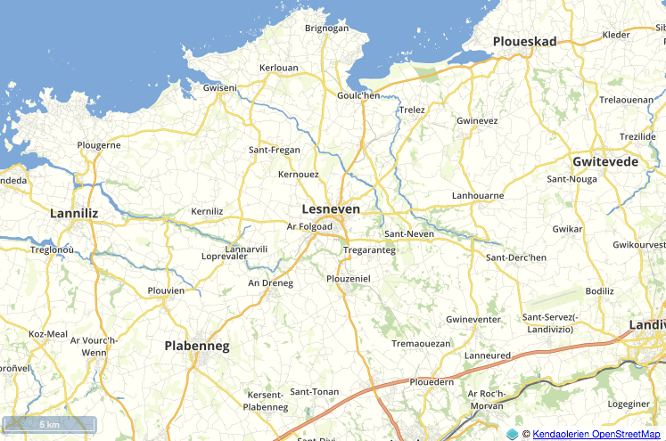
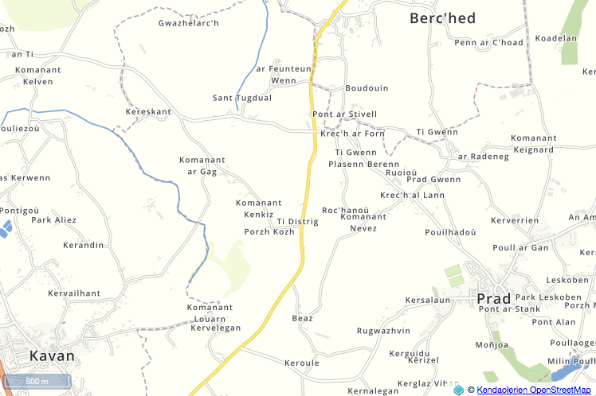
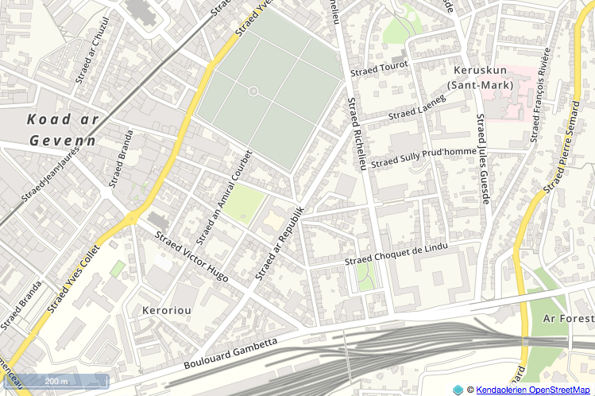

# English

This is the OSM Mapnik style for the osm-bzh project ([www.openstreetmap.bzh](www.openstreetmap.bzh)).
It is derived from the Lyrk mapstyle you can found at [https://github.com/lyrk/lyrk-mapstyle](https://github.com/lyrk/lyrk-mapstyle).

**This style has been created to set up tile map services for minorred langages in France** :

* [breton](https://tile.openstreetmap.bzh/br/)
* [occitan](https://tile.openstreetmap.bzh/oc/)
* [basque](https://tile.openstreetmap.bzh/eu/)
* [alsacien](https://tile.openstreetmap.bzh/gsw/)
 


# French

Ceci est le style OSM Mapnik pour le projet osm-bzh ([www.openstreetmap.bzh](www.openstreetmap.bzh)).
Il est dérivé du style Lyrk que vous pouvez trouver ici : [https://github.com/lyrk/lyrk-mapstyle](https://github.com/lyrk/lyrk-mapstyle).

**Ce style a été créé afin de mettre en œuvre des services cartographiques de tuiles pour les langues minorées de France** :

* [breton](https://tile.openstreetmap.bzh/br/)
* [occitan](https://tile.openstreetmap.bzh/oc/)
* [basque](https://tile.openstreetmap.bzh/eu/)
* [alsacien](https://tile.openstreetmap.bzh/gsw/)


# Preview












# Set up

## Create an unix user and clone this repository

Create a user 'osmbr' on your server.

Create directories and clone this repository :

```
mkdir /data
mkdir /data/dumps
mkdir /data/styles

cd /data/styles/
git clone https://github.com/osm-bzh/osmbr-mapstyle.git

# rename the directory
mv osmbr-mapstyle br

# move to the git clone repository
cd /data/styles/br/
```

## Get low scales datas

We use 2 layers for low scales. They need to be in /data/styles/data/ :

* simplified-land-polygons-complete-3857/simplified_land_polygons.shp
* land-polygons-split-3857/land_polygons.shp

```
cd /data/styles/data/

wget https://osmdata.openstreetmap.de/download/simplified-land-polygons-complete-3857.zip
unzip simplified-land-polygons-complete-3857.zip

wget https://osmdata.openstreetmap.de/download/land-polygons-split-3857.zip
unzip land-polygons-split-3857.zip

cd simplified-land-polygons-complete-3857
shapeindex *.shp

cd ../land-polygons-split-3857
shapeindex *.shp
```


## The database

### Data model

**We use the classic planet_osm database an tables** loaded by the famous osm2pgsql programm.

In your ```/etc/hosts``` file, add an entry for **db.openstreetmap.world**, with the IP of your PostgreSQL database server.

### Create database and role

Create the database and the 'osmbr' role : 

```bash
# osm user
psql -c "CREATE USER osmbr WITH LOGIN SUPERUSER PASSWORD 'm4d31nbr31zh';"

# the database
psql -c "CREATE DATABASE osm WITH OWNER = osmbr ENCODING = 'UTF8';"

# 2 classic extensions for OSM
psql -d osm -c "CREATE EXTENSION IF NOT EXISTS hstore;"
psql -d osm -c "CREATE EXTENSION IF NOT EXISTS postgis;"
```

### Load datas

Then run ```/scripts/update_db.sh``` to load the database.
It will :

* downloads a France OpenStreetMap dump file (.pbf file)
* extracts a smaller data subset (Britanny)
* loads the database


## See the map

You can set up a whole tile server (see [here](https://switch2osm.org/serving-tiles/)) or, easier and faster, use [Kosmtik](https://github.com/kosmtik/kosmtik).


