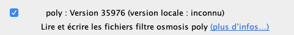
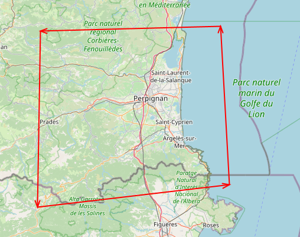

## Comment créer un fichier .poly

Lire [https://wiki.openstreetmap.org/wiki/Osmosis/Polygon_Filter_File_Format](https://wiki.openstreetmap.org/wiki/Osmosis/Polygon_Filter_File_Format)

1. Ouvrir JOSM
2. activer le greffon "poly"

2. Créer un nouveau calque et le renommer
3. Dessiner un polygone

4. Menu "Fichier > Enregister" pour sauvegarder la couche au format `.osm`, puis…
5. Menu "Fichier > Enregistrer sous…" et nommer le fichier `{mon_fichier}.poly`

Et voilà : on obtient un fichier .poly exploitable par `osmconvert`.

